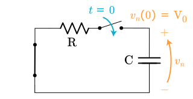

The *forced response* is not an easy concept. In the academic world prominent authors define this term different ways. I wasn't aware of dual definitions---I always thought there was just one definition of forced response, the one I was taught in school. Then a visitor pointed out the other definition, which threw me for a loop. I decided to review multiple text books and write down both perspectives so I could learn the difference, and share it with you.

Written by Willy McAllister. 

----

### Contents
{:.no_toc}

* Will be replaced with the ToC
{:toc}

----

### Where we're headed 
{:.no_toc}

* The forced response can be defined two ways.
* If you are talking to someone about forced response and you sense a disconnect it may be because of different electronics backgrounds.
* Few engineers are aware there are two definitions. Most students don't buy two expensive textbooks on the same topic, so we never run across the other definition.
* None of this matters for the final answer, the complete response---the one you observe with an oscilloscope. It comes out the same. You can be confident in your answer with either definition. 
* What does matter is the process you use to find the forced response. There is also a small difference in how you represent the natural response.

Not surprisingly, I prefer one definition over the other, and I will let you know why. I use that definition to derive the [RC step response]().

----

## Definitions

Forced response can be defined two ways,

1. Forced response is the circuit's final steady state, caused by the forcing input.
2. Forced response is the circuit's response when the initial conditions are set to $0$.

These two relatively modern well-known textbooks represent both sides. Both of these books have trained many electrical engineers,

Agarwal_Lang_textbook.jpg 
Agarwal and Lang, Foundations of Analog and Digital Electronic Circuits  
200px  
 
[Agarwal and Lang](https://www.amazon.com/Foundations-Electronic-Circuits-Kaufmann-Architecture/dp/1558607358), *Foundations of Analog and Digital Electronic Circuits*, p. 506. 


Alexander_Sadiku_textbook.jpg 
Alexander and Sadiku, Fundamentals of Electronic Circuits  
240px  
 
[Alexander and Sadiku](https://www.amazon.com/Fundamentals-Electric-Circuits-Matthew-Sadiku-ebook/dp/B008K9U418), *Fundamentals of Electric Circuits*, 5th Edition, p. 275.


## Agarwal and Lang

**Forced response: The circuit’s final steady state, caused by the forcing input.**

Agarwal and Lang find the step response using a mathematical theory,

>The total solution to a non-homogeneous differential equation can be found by the sum of the **general** solution of the circuit's natural response with **any particular** response (found without regard for the initial conditions), followed by applying the initial conditions to resolve unknown constants.

Find the *general* form of the natural response (the form with $K_n$ as the arbitrary constant),

$v_n = K_n\,e^{st}$

Then find a specific particular solution, the one that represents the long term steady-state response of the circuit. This particular particular solution is easy to find compared to others. We give it the name *forced response*. The forced response is the step voltage,

$v_f = \text V_\text S$ 

Add $v_n + v_f$ to get the complete response in general form,

$v_{tot} = K_n\,e^{-t/\text{RC}} + \text V_\text S$

We've held off applying the initial condition until now. It's finally time to apply it to the *total* response. This resolves $K_n$ and gives us the answer,

$v(0) = \text V_0$

$v_{tot} = (\text V_0 - \text V_\text S)\,e^{-t/\text{RC}} + \text V_\text S$


The total response (middle) is the sum of natural plus forced. $(\text V_0 - \text V_\text S)\,e^{-t/\text{RC}} + \text V_\text S$
{: .caption :}

With this definition the natural response is a scaled version of the $\text{RC}$ natural response you are used to---the one that starts at $\text V_0$ and ends at $0$. It may look a little goofy hanging down below the time axis, but it is just scaled/flipped to make it blend perfectly between the initial condition and the final voltage.

This is my preferred way to define the forced response. I like the clear difference between the transient portion and the steady-state portion. 

At Khan Academy we would say this is the *mathy* way to solve the problem. Critics say this gets you to a correct answer but without the physical insight into what is happening. Adherents say pshaw I can handle that---besides, this method generalizes to non-constant forcing functions like ramps or sine waves.

# Tooltip

I'm talking about Hover over me
  
  
 for the next little while.

And we move on.

## Alexander and Sadiku 

This text finds the step response three ways. Initially by *separation of variables*, then by *superposition* described here, and finally by the mathy method shown above. The superposition method uses this definition,

**Forced response: What the circuit does when the initial conditions are set to $0$.**

This time we solve the step response by the traditional superposition method. The two energy sources are separated into two sub-circuits. The two solutions are superimposed (added) to get the total solution,

rc_step_superposition_natural.svg 
Superposition sub-circuit for natural response
180px  
Superposition sub-circuit for the natural response with input suppressed. 

rc_step_superposition_forced.svg 
Superposition sub-circuit for forced response
180px  
Superposition sub-circuit to find the forced response with initial condition suppressed. 


The natural response sub-circuit on the left has an initial voltage on the capacitor, $v(0) = \text V_0$ and the input suppressed (turned off), $\text V_\text S = 0$. The result is the traditional $\text{RC}$ natural response,

$v_n = \text V_0\,e^{-t/\text{RC}}$

The forced response sub-circuit on the right has the input restored and the initial conditions suppressed, $\text V_0 = 0$. The modeling equation is the same non-homogeneous equation we derived earlier, 

$\dfrac{dv_f}{dt} + \dfrac{v_f}{\text{RC}} = \dfrac{\text V_\text S}{\text{RC}}\qquad$ with initial condition: $v_f(0) = 0$

This is the original difficult non-homogeneous equation with a $0$ initial condition. So now what? Alexander and Sadiku find $v_{tot}$, the general form of the total solution using the method of [separable differential equations](#appendix---separable-differential-equation),

$v_{tot} = (\text V_0 - \text V_\text S)\,e^{-t/\text{RC}} + \text V_\text S$

and then replace $\text V_0$ with $0$,

$v_f = -\text V_\text S\,e^{-t/\text{RC}} + \text V_\text S$

START HERE
$v_f$ is defined to be the *forced response*. Notice with this definition of forced response has a steady-state portion *and* a transient portion.

The total response is the superposition of 

$v_{tot} = v_n + v_f$

$v_{tot} = \text V_0\,e^{-t/\text{RC}} -\text V_\text S\,e^{-t/\text{RC}} + \text V_\text S$

$v_{tot} = (\text V_0 - \text V_\text S)\,e^{-t/\text{RC}} + \text V_\text S$


The total response (top) is the sum of natural plus forced : $v_{tot} = (\text V_0 - \text V_\text S)\,e^{-t/\text{RC}} + \text V_\text S$
{: .caption :}

|Complete response |=|natural response (stored energy)|+|forced response (input energy)|
{:.noborder }

The authors mention the other method of finding the step response by mathematical means, 

|Complete response |=|transient response (temporary part)|+|steady-state response (permanent part)|
{:.noborder }

They don't call the particular response the forced response. They give that name to a different term.

Alexander and Sadiku solve the step response knowing it is a *separable differential equation*. This derivation, shown in [RC step response appendix](#appendix---separable-differential-equation), produces the complete solution, 

$v_{tot} = (\text V_0 - \text V_\text S)\,e^{-t/\text{RC}} + \text V_\text S$

Given this complete solution there are two classical ways to rearrange the algebra and give names to the terms,  

Natural + Forced = Complete  
or  
Transient + Steady-state = Complete

In the first case, Natural + Forced, the Forced response has a transient portion and a steady-state portion. 

## Define forced response

1. The final steady-state caused by the forcing input. This includes only the steady-state section, with the transient period being described by the natural response.  
https://www.sciencedirect.com/topics/computer-science/forced-response: The forced response, yi, depends upon the particular input of the system and is usually the same form as the input. http://web.mit.edu/16.unified/www/FALL/signalssystems/Lecture16_17.pdf: A common method for solving for the particular solution is to try a solution of the same form as the input
– This is called the “forced response”.  
Fitzgerald, Higginbotham, Grabel, *Basic Electrical Engineering*, 3rd Edition, p. 76-77, 89. 

2. The full path the circuit takes from initial conditions = 0 all the way until it reaches steady state. This includes a transient period followed by the steady-state response. The natural response is another transient period that deals with the dissipation of initial stored energy. In this definition we resolve $K_n$ right after finding the general solution to natural response. By allowing the forced response to include a transient component that introduces a scaling constant $K_ft$ to the forced response.  
Ribas: Forced response is the system's response to an external stimulus with zero initial conditions.

Definition 1 is the approach taken here, where we develop the general solution to natural and forced responses, combine them by superposition, and *then* apply the initial condition. 

Definition 2 is what you work through if you use a traditional superposition approach of separating and isolating each energy source. We break the circuit into a zero-input sub-circuit and a zero-state sub-circuit. The challenge here is solving the still-complicated zero-state sub-circuit since it has a transient part and an unrelated steady-state part. Ribas does this by coming up with an 'adjustment factor' (another exponential term) to "correct" the natural response. Seems hokey.

Both definitions use superposition to come up with the same answer for the step response, which is the only thing that's observable and therefore the only thing that matters.

## Summary
{:.no_toc}

The two definitions can be revealed by decomposing the total response. We start with the total response and pull it apart and regroup the terms to reveal the different vocabulary. The total response is the same in both cases, but we group terms in slightly different ways. The terms "forced" and "natural" are assigned to different things in each definition.

Agarwal: The decomposition of the complete response is based on *permanency*. The natural response is the temporary transient part and the forced response is the permanent steady-state part.

Sadiku: The decomposition is based on the *sources of energy*. The natural response comes from the stored energy and the forced response comes from the input energy.