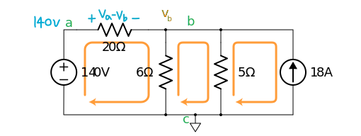
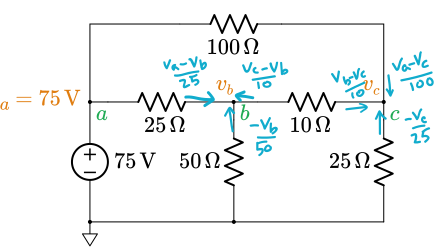

The Node Voltage Method is one of the well-organized methods for analyzing a circuit. It is based on [Kirchhoff's Current Law](electrical-engineering/ee-circuit-analysis/a/ee-kirchhoffs-laws). The Node Voltage Method is embedded inside the popular circuit simulator, $\small \text{SPICE}$.

Written by Willy McAllister.

----

### Contents
{: .no_toc :}

* Will be replaced with the ToC
{: toc :}

----

### Where we're headed 
{: .no_toc :}

This article teaches you the Node Voltage Method by working through two example circuits. We also figure out how to handle the special case of a floating voltage source (something called a *supernode*).

**Node voltage method**  
* Assign a reference node (ground).
* Assign node voltage names.
* Solve the nodes with a voltage source connected to the reference node.
* Write Kirchhoff's Current Law for each node.
* Solve the resulting system of equations.
* Solve the currents.

----

## The circuit analysis challenge

"Solving a circuit" means figuring out all the voltages and currents in the circuit. At the outset, every circuit element has an unknown voltage and unknown current. For a circuit with $E$ elements, solving the circuit requires us to create and simultaneously solve $2E$ independent equations. Where do we find these equations? Half of them come from individual element $i$-$v$ laws (like Ohm's Law). The rest come from the connections between elements (represented by KCL or KVL).

No matter what procedure you use to solve a circuit, there is no getting around the requirement to create and solve $2E$ simultaneous equations. This can be a lot of work, but there are ways to organize the effort to make it very efficient. The Node Voltage Method is one of two very efficient procedures we have for solving circuits. (The other is the [Mesh Current Method]({{ site.baseurl }}).) 

The Node Voltage Method is not mysterious new science. It is simply a procedure for creating the $2E$ equations. We will demonstrate the Node Voltage Method with this circuit,

{: .centered :}

## Prepare the schematic

Start every circuit analysis by finding and naming all the nodes. Then identify one of the nodes to be the *reference node*. The reference node is also called the *ground node*. The potential of the ground node is defined to be $0\,\text V$. 

{: .centered :}

I picked node $\greenD c$ to be the reference node, as shown by the little triangle symbol. Node $\greenD c$ is a good choice because it has lots of connections and the two sources are directly connected.

## Definition: node voltage

To use the Node Voltage Method we need a new term: *node voltage*. A node voltage is a potential difference measured between the reference node and another node in the circuit. (Up to now, we've talked about the voltage across the terminals of a single element. This is called an *element voltage* (or *branch voltage*). The concepts are very similar but not identical.) 

The example circuit has two node voltages, labeled $\goldD{v_a}$ and $\goldD{v_b}$.

{: .centered :} 

The node voltage arrows always start at the reference node. Each one arcs up to another circuit node, in this case to nodes $a$ and $b$. 

A node voltage can also be an element voltage. For example, $v_b$ is a node voltage and also the element voltage for the $5\,\Omega$ resistor, $6\,\Omega$ resistor, and the current source. But notice how the schematic shows no element voltage for the $20\,\Omega$ resistor. It can be derived from the difference of two node voltages, $v_a - v_b$. 

## Control the current arrow

Let's mess around a little with the node voltage concept. Node voltages control the direction of the current arrow! What does that mean?

We didn't indicate an element voltage for the $20\,\Omega$ resistor. Instead, we can express that element voltage using the two node voltages on either side of the resistor. The element voltage could be written as either,

$\large v_{\text{R}20} = v_a - v_b\qquad$ or $\large \qquad v_{\text{R}20} = v_b - v_a$

We make our choice depending on which way we want the current arrow to point.

>Essential skill - The difference expression controls the current arrow.

The element voltage across the $20\,\Omega$ resistor can be written with either $v_a$ or $v_b$ in the first position in the difference equation. Whichever voltage we write first is considered the more positive when we use the [sign convention for passive components]({{ site.baseurl }}). The choice of the first voltage term determines the direction of the current arrow. The current arrow points *into* the resistor terminal with the first voltage term.

{: .centered :}

Above left, $v_a$ is in the first position. The voltage arrow points towards node $a$, and the current arrow points into node $a$.

Above right, $v_b$ is now in the first position. The voltage arrow is flipped towards node $b$, and the current arrow turns around and points into node $b$.

We are going to use our new skill immediately, to control the direction of the current arrow in the first term of the KCL equation coming up next.

## Node Voltage Method

The Node Voltage Method is this sequence of steps,

* Assign a reference node (ground).
* Assign node voltage names to the remaining nodes.
* Solve the easy nodes, the ones with a voltage source connected to the reference node.
* Write Kirchhoff's Current Law for each node. Do Ohm's Law in your head.
* Solve the resulting system of equations to find all the node voltages.
* Solve the currents you want using Ohm's Law.

### Assign a reference node

We already did this above, but let's do it again. Our example circuit has three nodes, $\greenD a$, $\greenD b$, and $\greenD c$. Node $\greenD c$ has a lot of connections, $4$, and it connects directly to both sources. This makes it a good candidate to play the role of reference node. Node $\greenD c$ has been marked with the ground symbol so everyone knows our choice for reference node.

{: .centered :}

### Assign node voltage names

Our circuit has $N=3$ nodes. After picking a reference node, we identify $N-1 = 2$ node voltages and name them $v_a$ and $v_b$, shown above. 

> Note: There is an obvious opportunity here to simplify the two parallel resistors, $6\,\Omega$ with $5\,\Omega$. I won't do that because I want to focus on the steps of the Node Voltage Method.

### Solve the easy nodes

Are there any easy nodes? There's a voltage source connected directly between node $\greenD a$ and the reference node $\greenD c$. That makes $\greenD a$ an easy node. We know right away voltage $v_a = 140\,\text V$.

{: .centered :}

### Write Kirchhoff's Current Law for the remaining node(s)

The next step is to write KCL equations for the remaining nodes. For us, that's just node $\greenD b$.

>Essential skill - Scribble on the schematic!    
The challenging part of writing KCL equations is getting the signs right. Scribble on the schematic. A lot. Draw voltage signs and current arrows to help you get the signs right in the KCL equation. 

>Essential skill - Do Ohm's Law in your head as you write KCL.    
As you write each term of the KCL equation, do Ohm's Law in your head and immediately write the current in terms of node voltages divided by resistance. 

Let's first work out the individual currents flowing in the three resistors connected to node $\greenD b$. Remember, scribbling is good.

{: .centered :}{: height="260px"}

I labeled the element voltage on the $20\,\Omega$ resistor with $v_a$ as the leading term, to get the current arrow to point towards the right, flowing into node $b$.  

The current flowing into node $b$ from the $20\,\Omega$ resistor is $+\dfrac{(v_a - v_b)}{20}$.

The currents flowing out of node $b$ from the $6\,\Omega$ and $5\,\Omega$ resistors are  $\dfrac{v_b}{6}$ and $\dfrac{v_b}{5}$. 

The $6\,\Omega$ and $5\,\Omega$ currents will appear in KCL with a negative sign, because I will be using the form of KCL that says “The sum of currents flowing into a node is zero.”. You can do KCL the way you prefer. Either way is fine as long as you pay attention and get the signs right.

The current source is driving its current of $18\,\text A$ into node $b$.

We now write the KCL equation for node $b$, 

$\displaystyle \sum_{n=1}^{n=4} i_{in_n} = 0$

$+\dfrac{(v_a - v_b)}{20} - \dfrac{v_b}{6} - \dfrac{v_b}{5} + 18 = 0$

This is the equation we have to solve to find $v_b$ (since we already know $v_a$). Notice how the first and last terms appear with $+$ signs because these currents flow *into* node $b$, and the two middle terms appear with $-$ signs because they are flowing *out*. 

The Node Voltage Method is pretty cool. Without too much effort, we came up with one equation in one unknown, $v_b$. When we solved this same circuit in a previous article with the improvised application of the fundamental laws, we had to manage $10$ equations with $10$ unknowns. The Node Voltage Method has a built-in efficiency that manages this complexity. 

### Solve the node voltages

Our system of equations happens to be just one equation. Let's solve it to find the node voltage.

$+\dfrac{140}{20} - \dfrac{v_b}{20} - \dfrac{v_b}{6} - \dfrac{v_b}{5} = -18$

$ - \dfrac{v_b}{20} - \dfrac{v_b}{6} - \dfrac{v_b}{5} = -18 - 7$

$ \left (- \dfrac{3}{60} - \dfrac{10}{60} - \dfrac{12}{60} \right ) \, v_b = -25$

$ v_b = -25 \, \left (- \dfrac{60}{25} \right )$

$v_b  = 60 \,\text V$

We have all the node voltages, $v_a = 140\,\text V$ and $v_b = 60\,\text V$.

### Solve the unknown currents using Ohm's Law

Now we can solve the unknown currents using Ohm's Law.

$i_{20\,\Omega} = \dfrac{(v_a-v_b)}{20} = \dfrac{(140-60)}{20} = 4\,\text A$

$i_{6\,\Omega} = -\dfrac{v_b}{6} = -\dfrac{60}{6} = -10\,\text A \quad$ This current is flowing down through the resistor.

$i_{5\,\Omega} = -\dfrac{v_b}{5} = -\dfrac{60}{5} = -12\,\text A\quad$ This current is flowing down as well.

Ta daaa! The circuit is solved.

You can confirm the answer by [simulating this example](https://spinningnumbers.org/circuit-sandbox/index.html?value=[["v",[120,72,0],{"name":"","value":"dc(140)","_json_":0},["5","0"]],["i",[312,120,6],{"name":"","value":"dc(18)","_json_":1},["1","4"]],["r",[216,72,0],{"name":"R2","r":"6","_json_":2},["4","3"]],["r",[264,72,0],{"name":"R3","r":"5","_json_":3},["4","2"]],["r",[144,56,3],{"name":"R1","r":"20","_json_":4},["5","4"]],["w",[120,120,120,152]],["w",[312,152,264,152]],["w",[120,72,120,56]],["w",[120,56,144,56]],["w",[312,56,312,72]],["w",[264,72,264,56]],["w",[312,56,264,56]],["w",[216,72,216,56]],["w",[264,56,216,56]],["g",[240,152,0],{"_json_":14},["0"]],["w",[264,152,240,152]],["w",[216,152,240,152]],["s",[312,56,0],{"color":"cyan","offset":"0","_json_":17},["4"]],["a",[216,144,3],{"color":"magenta","offset":"0","_json_":18},["0","3"]],["w",[216,120,216,128]],["w",[216,152,216,144]],["a",[264,144,3],{"color":"magenta","offset":"0","_json_":21},["0","2"]],["w",[264,120,264,128]],["w",[264,152,264,144]],["a",[312,144,3],{"color":"magenta","offset":"0","_json_":24},["0","1"]],["w",[312,152,312,144]],["w",[312,120,312,128]],["w",[192,56,216,56]],["w",[264,56,216,56]],["w",[120,152,216,152]],["w",[264,152,240,152]],["w",[216,152,240,152]],["view",59.66,6.292000000000002,2.44140625,"50","10","1G",null,"100","0.01","1000"]]). Open the link, and click on **DC** in the to menu to perform a DC analysis. Do a quick mental addition to confirm KCL at node $b$. Do the currents add up to zero?

Is the Node Voltage Method magic?

Going through this Node Voltage Method seemed like a lot less work than creating, managing, and solving a system of $2E$ independent equations with $2E$ unknown voltages and currents. Is this some sort of magic? 

No, there is no magic. The Node Voltage Method is simply a cleverly organized way to approach the same $2E$ equations. The main innovations are,

<ul>
<li>We are confident we can do Ohm's Law in our heads while writing the KCL equations. Being this quick with Ohm's Law makes it seem like half of the independent equations are no big deal. We used Ohm's Law towards the end to find the resistor currents. This didn't seem like much of a chore, either. </li>
<li>Using the concept of *node voltage* instead of element voltage is a brilliant move that basically annotates KVL equations right on the schematic, so we don't have to write KVL equations.</li>
<li>We recognized that a few node voltages have trivial solutions, the ones connected to a voltage source whose other terminal is ground. This typically knocks out one or two equations.</li>
<li>What remains to solve are the KCL equations at the non-trivial nodes.</li></ul>

How does the Node Voltage Method make the KVL equations "go away"?

With the Node Voltage Method, we don't even bother to write down the KVL equations that are always part of the $2E$ collection. Let's write them anyway and see why.

Our circuit has three meshes, in the left, middle, and right 'windows' of the schematic.

KVL for the left mesh,

$+140 - (140 - v_b) - v_b = 0$

This left mesh equation really illustrates the point of node voltages. We express the voltage across the $20\,\Omega$ resistor in terms of node voltages instead of its own element voltage. With this notation, the equation collapses to $0 = 0$.

KVL for the middle mesh,

$+v_b - v_b = 0$

KVL for the right mesh,

$+v_b - v_b = 0$

All three mesh equations reduce to $0 = 0$ and basically drop out of the procedure. This is what your textbook means if it says something like, "With the Node Voltage Method, the KVL equations are written implicitly on the schematic."

## Guided example

**Solve this circuit using the Node Voltage Method.** 

{: .centered :}

If you want to work this problem on your own, go for it! Copy this schematic and work through the steps of the Node Voltage Method listed above. Even if you don't carry the computation all the way through, I encourage you to at least do the steps up to writing the KCL's.

**Assign a reference node.**  

Assign the reference node.

The node at the bottom of the schematic is a good choice for the reference node, because it has many connections ($3$) and it connect to the negative terminal of the voltage source.

**Assign node voltage names to the remaining nodes.**  

Name the nodes and assign node voltages.

There are three other nodes besides the reference node. I named them $\greenD a$, $\greenD b$, and $\greenD c$, with the corresponding node voltages, $v_a$, $v_b$, and $v_c$.

**Solve the easy nodes first.**

Solve the easy nodes.

Node $\greenD a$ is an easy node because it connects to a voltage source whose other terminal connects to ground.

We know the voltage at node $\greenD a$ by inspection is $v_a = 75\,\text V$.

**Write Kirchhoff's Current Law for each node. Do Ohm's Law in your head.**  

Write Kirchhoff's Current Law for the remaining nodes, with scribbling.

Before writing KCL, it is good practice to scribble notes on the schematic to establish the direction of the current arrows. This helps get the sign and order of the voltage terms right. I'm setting up the current arrows so I can use the form of KCL that sums the currents going <em>into</em> a node.

Take a good look at the numerators of each scribble. Notice how you can pick the order of the voltages to control the direction of the current arrow. Check out how the current in the $10\,\Omega$ resistor is specified two different ways by exchanging the voltage terms.
 

Node $\greenD b$: $\qquad+\dfrac{v_a - v_b}{25} - \dfrac{v_b}{50} + \dfrac{v_c - v_b}{10} = 0$

Node $\greenD c$: $\qquad+\dfrac{v_a - v_c}{100} + \dfrac{v_b-v_c}{10} - \dfrac{v_c }{25} = 0$

**Solve the resulting system of equations for all node voltages.**  

Solve the system of equations.

I'm going  find the two unknown node voltages, $v_b$ and $v_c$, using <a href="https://www.khanacademy.org/math/algebra-home/alg-system-of-equations/alg-equivalent-systems-of-equations/a/elimination-method-review">elimination by multiply and add</a>.

First, tidy up by gathering like terms together, and move the already-solved $v_a$ terms over to the right, 

$\text{Node }\greenD b$: $\qquad-\dfrac{v_b}{25} - \dfrac{v_b}{50} - \dfrac{ v_b}{10} + \dfrac{v_c}{10} = -\dfrac{v_a}{25}$

$\text{Node }\greenD c$: $\qquad+\dfrac{v_b}{10} - \dfrac{v_c}{100} - \dfrac{v_c}{10} - \dfrac{v_c }{25} = -\dfrac{v_a}{100}$

Simplify to get a system of two equations in two unknowns,

$\text{Node }\greenD b$: $\qquad-\dfrac{8}{50} v_b + \dfrac{1}{10}v_c = -\dfrac{75}{25} = -3$

$\text{Node }\greenD c$: $\qquad+\dfrac{1}{10}v_b - \dfrac{15}{100} v_c = -\dfrac{75}{100} = -\dfrac{3}{4}$

To eliminate $v_c$, multiply the first equation by $\dfrac{15}{10}$ and add it to the other equation,

$\begin{aligned}
&\text{Node }\greenD b: &\dfrac{15}{10} \times \biggl [ -\dfrac{8}{50} v_b + \dfrac{1}{10}v_c  &  =  -3 \ \ \biggr ] \\
\\
&\text{Node }\greenD c: &+\biggl [ +\dfrac{1}{10}v_b - \dfrac{15}{100} v_c  &  = -\dfrac{3}{4} \ \biggr ]
\end{aligned}$

Multiply through. The $v_c$ terms cancel. Add the equations, 

$\begin{aligned}
&\text{Node }\greenD b: & \biggl [-\dfrac{15 \cdot 8}{10 \cdot 50}\,v_b + \cancel{\dfrac{15\cdot 1}{10 \cdot 10}\,v_c}  &  = -\dfrac{15 \cdot 3}{10 \cdot 1} \ \biggr ] \\
\\
&\text{Node }\greenD c: &+ \biggl [ +\dfrac{1}{10}v_b - \cancel{\dfrac{15}{100} v_c}  & =  \,-\dfrac{3}{4} \ \ \biggr ] \\
\\
&\text{Sum}: &\left ( \dfrac{-15 \cdot 8}{500} + \dfrac{1}{10} \right ) \, v_b & = -\dfrac{45}{10}-\dfrac{3}{4} \\
\\
&&\dfrac{-120 + 50}{500}\,v_b &= -\dfrac{90}{20}-\dfrac{15}{20} \\
\\
&&-\dfrac{70}{500}\,v_b &= -\dfrac{105}{20} \\
\\
&&v_b &= -\dfrac{105}{20}\cdot -\dfrac{500}{70} \\
\\
&&v_b &= +37.5\,\text V
\end{aligned}$

Now go back and plug our new $v_b$ into either of the original KCL equations to find $v_c$, 
(I will use the equation for node $\greenD c$.)

$\begin{aligned}  
&\text{Node }\greenD c: &+\dfrac{1}{10}\,v_b - \dfrac{15}{100} v_c &= -\dfrac{3}{4} \\
\\
&&+\dfrac{1}{10}\,37.5 - \dfrac{15}{100} v_c  &= -\dfrac{3}{4} \\
\\
&&-\dfrac{15}{100} v_c  &= -0.75 - 3.75 \\
\\
&&v_c &= -4.5\cdot -\dfrac{100}{15} \\
\\
&&v_c &= +30\,\text V  
\end{aligned}$

**Solve any currents you want to know using Ohm's Law.**  

Solve the currents using Ohm's Law.

$\begin{aligned}  
&i_{ab\,25\Omega} = \dfrac{75 - 37.5}{25} &&= 1.5\,\text A &&\text{current arrow pointing to the right.} \\
\\
&i_{bg\,50\Omega} = \dfrac{37.5}{50} &&= 0.75\,\text A &&\text{current arrow pointing down.} \\
\\
&i_{bc\,10\Omega} = \dfrac{37.5-30}{10} &&= 0.75\,\text A &&\text{current arrow pointing to the right.} \\
\\
&i_{ac\,100\Omega} = \dfrac{75-30}{100} &&= 0.45\,\text A &&\text{current arrow pointing to the right.} \\
\\
&i_{cg\,25\Omega} = \dfrac{30}{25} &&= 1.2\,\text A &&\text{current arrow pointing down.}
\end{aligned}$

As a bonus, the current provided by the voltage source is,

$i_v = i_{100\Omega}+i_{ab\,25\Omega} = 0.45\,\text A + 1.5\,\text A = 1.95\,\text A$

The solved circuit looks like this,

### Simulation model

You can confirm your answer by simulating the [guided example circuit](https://spinningnumbers.org/circuit-sandbox/index.html?value=[["v",[96,96,0],{"name":"V","value":"dc(75)","_json_":0},["2","0"]],["r",[192,64,1],{"name":"R1","r":"25","_json_":1},["5","3"]],["r",[288,64,1],{"name":"R2","r":"10","_json_":2},["4","5"]],["r",[216,96,0],{"name":"R4","r":"50","_json_":3},["5","0"]],["r",[328,96,0],{"name":"R5","r":"25","_json_":4},["4","0"]],["r",[240,24,1],{"name":"R3","r":"100","_json_":5},["4","1"]],["w",[96,144,96,168]],["w",[96,168,216,168]],["w",[216,168,216,144]],["w",[328,168,328,144]],["w",[216,96,216,64]],["w",[192,64,216,64]],["w",[240,64,216,64]],["w",[328,64,328,96]],["w",[328,24,328,64]],["g",[96,168,0],{"_json_":15},["0"]],["w",[328,24,240,24]],["w",[328,64,288,64]],["w",[328,168,216,168]],["w",[96,24,96,64]],["w",[96,96,96,64]],["a",[104,64,0],{"color":"magenta","offset":"0","_json_":21},["2","3"]],["w",[144,64,120,64]],["w",[96,64,104,64]],["a",[104,24,6],{"color":"magenta","offset":"0","_json_":24},["2","1"]],["w",[96,24,104,24]],["w",[192,24,120,24]],["view",-8.300000000000011,-17.260000000000005,1.953125,"50","10","1G",null,"100","0.01","1000"]]). Open the link, and click on **DC** in the to menu to perform a DC analysis.

## A twist - floating voltage source

Sometimes you come across a circuit where a voltage source does not have either of its terminals connected to the reference node. A source like this is said to be *floating*. A floating source is a problem for the Node Voltage Method, but it is not too big of a challenge.

{: .centered :}

In this circuit, battery $\text V_2$ is floating. Let's use the Node Voltage Method and see what happens. 

* The reference node has been selected and marked with the ground symbol. 
* The other three nodes have been named and assigned node voltages, $\goldD{v_a}$, $\goldD{v_b}$ and $\goldD{v_c}$. 
* Node $\greenD a$ is an easy node, since it is connected to $\text V1$ and then to ground. We immediately know $\goldD{v_a} = \text V_1$. 
* The next step is to write a KCL equation for node $b$. 

$\quad i_{\text R2} \quad + \quad i_{\text R_3} + i_{\text V_2} = 0$

$\dfrac{(v_a - v_b)}{\text R2} - \dfrac{v_b}{\text R3} + i_{\text V_2}? = 0$

Oops, we have to somehow figure out the current in the floating battery, $i_{\text V_2}$. But the defining equation for the battery does not mention current. Its defining equation is $v = \text V$. There is no $i$ involved. A battery doesn't tell us what its own current is. So what do we do?

At this point we break away from the standard script for Node Voltage Method, and resort to our own creativity. It is okay to do this. Remember the Node Voltage script nothing more than an efficient way to create simultaneous equations. The floating battery is giving us a little trouble, so we're going to do a little improvising. Here's the circuit again,

{: .centered :}

We make two observations,

* The voltage at node $c$ has a rigid relationship to the voltage at node $b$. Namely, $v_c = v_b + \text V_2$. Let's add this equation to our system of equations. 

* The current in battery $i_{\text V_2}$ is identical to the current in resistor $\text R1$. This gives us a way to figure out $i_{\text V_2}$.

$i_{\text V_2} = i_{\text R_1} = \dfrac{\text V_1 - v_c}{\text R1}$ 

 We know how to express $v_c$ in terms of $v_b$, giving us this expression for $i_{\text V_2}$,

$i_{\text V_2} = \dfrac{\text V_1 - (v_b + \text V_2)}{\text R1}$

Now we can go back and finish up the KCL equation for node $b$. 

$\dfrac{(v_a - v_b)}{\text R2} - \dfrac{v_b}{\text R3} + \dfrac{\text V_1 - (v_b + \text V_2)}{\text R1} = 0$

This equation is a little more complicated than usual, but it is still just one equation in one unknown, $v_b$. Once we solve for $v_b$, we use our extra equation to immediately get $v_c$.

$v_c = v_b + \text V_2$
 
Done! We have the three node voltages. In this floating battery example, we had one easy node, one KCL equation, and one equation representing the interlocked nodes of the floating battery.

If you want to find currents, proceed with Ohm's Law as we did earlier. 

>The floating voltage source is a favorite for teachers to put on tests, to see how you respond to an unexpected circuit configuration. We got through the difficulty by being observant and remembering that it is alright to come up with your own extra equation if needed. 

### Supernode

This pair of constrained floating nodes is called a *supernode*. I could have used that term and come up with some rules for what to do. Instead, we resorted to our creativity to work through the puzzle. Some textbooks add extra steps to the Node Voltage Method to account for a supernode. But I like to keep the steps simple and allow myself to mess around and come up with an extra constraint equation when needed. 

## Summary
{: .no_toc :}

The Node Voltage Method is one of two efficient methods of solving a circuit. This method is embedded inside the popular circuit simulator, $\small \text{SPICE}$. The steps in the Node Voltage Method are,

* Assign a reference node (ground).
* Assign node voltage names to the remaining nodes.
* Solve the easy nodes first, the ones with a voltage source connected to the reference node.
* Write Kirchhoff's Current Law for each node. Do Ohm's Law in your head.
* Solve the resulting system of equations to find all the node voltages.
* Solve the currents you want using Ohm's Law.

If the circuit includes a floating voltage source, come up with an extra equation to account for the unknown current in the voltage source.
